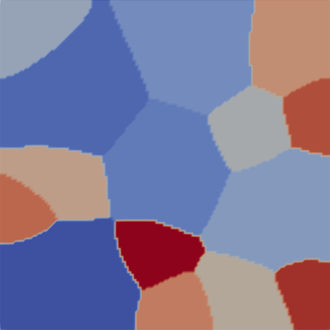

__JAX-PF__: an efficient GPU-computing simulation for differentiable phase field (PF) simulaiton, built on top of [JAX-FEM](https://github.com/deepmodeling/jax-fem). Leveraging [JAX](https://github.com/google/jax), this tool addresses the need for co-designing of material and manufacturing processes, supporting the goals of the Materials Genome Initiative, and as a part of the Integrated Computational Materials Engineering. 

## The concept of differentiable PF
We want to emphasize the following four features that differential JAX-PF from other PF software:
- __Ease-of-use__: Leveraging capability of automatic differentiation (AD) in JAX, JAX-PF automatically generates Jacobians and derivatives of different energy terms with machine precision, enabling the realization of multi-physics and multi-variable PF models.
- __Automatic Sensitivity__: Implicit time integration with customized adjoint-based AD enables efficient gradient-based optimization and inverse design of strongly nonlinear PF systems.
- __High-performance GPU-acceleration__: Through the XLA backend and vectorized operations, JAX-PF delivers competitive GPU performance, drastically reducing computational time relative to CPU-based solvers.
- __Unified multiscale ecosystem with JAX-CPFEM__: Built on the same JAX-FEM foundation, JAX-PF integrates seamlessly with [JAX-CPFEM](https://github.com/SuperkakaSCU/JAX-CPFEM) to enable coupled process–structure–property simulations (e.g., dynamic recrystallization), while preserving full differentiability for optimization and design.
  

:fire: ***Join us for the development of JAX-PF! This project is under active development!***


## Applications
### Benchmarks
Four benchmark problems are provided, including [Allen–Cahn](https://en.wikipedia.org/wiki/Allen%E2%80%93Cahn_equation), [Cahn–Hilliard](https://en.wikipedia.org/wiki/Cahn%E2%80%93Hilliard_equation), coupled Allen–Cahn and Cahn–Hilliard, each implemented with both explicit and implicit time integration, and [Eshelby inclusion](https://en.wikipedia.org/wiki/Eshelby%27s_inclusion) for lattice misfit in solid-state phase transformations.

:mega: JAX-PF reproduces the benchmark results with good agreement to [PRISMS-PF](https://github.com/prisms-center/phaseField).


<p align="middle">
  
<p align="middle">
    <em >Validation of benchmark problems in JAX-PF, including the Allan-Cahn equation for non-conserved PF variable, the Cahn-Hilliard equation for conserved PF variable, and the Eshelby inclusion problem capturing displacement fields around a misfitting inclusion. While PRISMS-PF implements explicit time integration, JAX-PF provides both explicit and implicit schemes, with results showing agreement between the two frameworks.</em>
</p>


### Forward Case Studies
Several representative applications are included, ranging from solidification to solid-state transformations: grain growth, static recrystallization, spinodal decomposition, precipitation with the Wheeler–Boettinger–McFadden (WBM) model, and precipitation with the Kim–Kim–Suzuki (KKS) model. 

:fire: ***For each case, both explicit and implicit time stepping schemes are provided***

<p align="middle">
  
  
<p align="middle">
    <em >The initial (left) and final (right) grain structure for a 2D grain growth simulation.</em>
</p>
<br>
<br>


<p align="middle">
  
  
<p align="middle">
    <em >The distribution of composition during a simulation of spinodal decomposition from initial fluctuations (left) to final two distinct phases (right).</em>
</p>
<br>
<br>


<p align="middle">
  
<p align="middle">
    <em >A 2D simulations of the multi-variants precipitate in an Mg-Nd alloy were simulated using different frameworks, based on Wheeler-Boettinger-McFadden (WBM) model.</em>
</p>
<br>
<br>


<p align="middle">
  
<p align="middle">
    <em >A 3D simulations of the single-variants precipitate in an Mg-Nd alloy were simulated using different frameworks, based on Kim-Kim-Suzuki (KKS) model.</em>
</p>
<br>
<br>


<p align="middle">
  
<p align="middle">
    <em >Simulated recrystallized microstructure. White color represents the new recrystallized grains, and black color represents grain boundaries.</em>
</p>
<br>
<br>


### Multiscale Simulations
:mega: JAX-PF and [JAX-CPFEM](https://github.com/SuperkakaSCU/JAX-CPFEM) are built on top of the same underlying [JAX-FEM](https://github.com/deepmodeling/jax-fem) ecosystem, the two can be tightly coupled within a single GPU-accelerated differentiable framework. This integration allows simultaneous treatment of process–structure and structure–property relationships, supporting multiscale simulations (PF-CPFEM) under complex internal and/or external applied fields.


<p align="middle">
  
<p align="middle">
    <em >Coupled JAX-PF and JAX-CPFEM framework for process–structure–property integration.</em>
</p>


### Inverse Design
:mega: Comming soon!!
<br>


## Installation
JAX-PF supports Linux and macOS, which depend on JAX-FEM.
### Install JAX-FEM
JAX-FEM is a collection of several numerical tools, including the Finite Element Method (FEM). See JAX-FEM installation [instructions](https://github.com/deepmodeling/jax-fem?tab=readme-ov-file). Depending on your hardware, you may install the CPU or GPU version of JAX. Both will work, while the GPU version usually gives better performance.

### Install Neper
[Neper](https://neper.info/) is a free/open-source software package for polycrystal generation and meshing. It can be used to generate polycrystals with a wide variety of morphological properties. A good [instruction](https://www.youtube.com/watch?v=Wy9n756wFu4&list=PLct8iNZXls-BMU7aleWoSoxgD8OFFe48W&index=5) video is on Youtube.


### Install JAX-PF
Place the downloaded `phaseField/` file in the `applications/` folder of JAX-FEM, and then you can run it.

### Quick Tests
For example, you can download `phaseField/allenCahn/explicit_fem` folder and place it in the `applications/` folder of JAX-FEM, run
```bash
python -m applications.phaseField.allenCahn.explicit_fem.explicit_AC
```
from the root directory. Use [Paraview](https://www.paraview.org/) for visualization.


## Tutorial
:mega: Comming soon!

## Citations
If you found this library useful in academic or industry work, we appreciate your support if you consider starring the project on Github.
